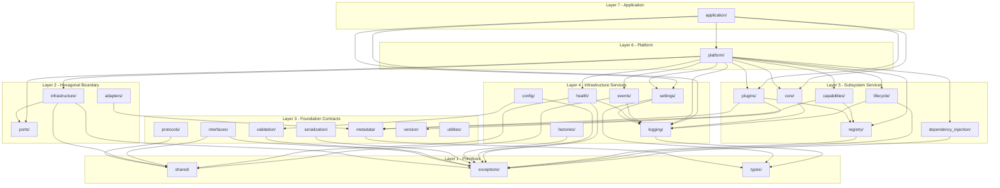

# EAIP Master Architecture & Constitution v1.0

> **Document Classification:** Constitutional — Normative  
> **Status:** Ratified  
> **Version:** 1.0.0  
> **Date:** 2026-07-02  
> **Author:** Consolidated from repository source of truth  
> **Owner:** Subham Panigrahi (@subham1902)  
> **License:** Apache License 2.0 — Copyright © 2026 Subham Panigrahi  
> **Canonical Location:** `CONSTITUTION.md` (repository root)

---

## Table of Contents

- [Preamble](#preamble)
- [Part I — Identity & Vision](#part-i--identity--vision)
  - [1.1 What EAIP Is](#11-what-eaip-is)
  - [1.2 The Digital Workforce Vision](#12-the-digital-workforce-vision)
  - [1.3 Constitutional Principles](#13-constitutional-principles)
  - [1.4 Explicit Non-Goals (v1)](#14-explicit-non-goals-v1)
- [Part II — Architectural Foundation](#part-ii--architectural-foundation)
  - [2.1 Three-Tier System Architecture](#21-three-tier-system-architecture)
  - [2.2 Dependency Layer Model](#22-dependency-layer-model)
  - [2.3 Architectural Invariants](#23-architectural-invariants)
  - [2.4 Design Patterns Canon](#24-design-patterns-canon)
- [Part III — Component Catalog](#part-iii--component-catalog)
  - [3.1 Foundation Layer (Implemented — EP-0002)](#31-foundation-layer-implemented--ep-0002)
  - [3.2 Control Plane (Planned — EP-0010+)](#32-control-plane-planned--ep-0010)
  - [3.3 Agent Runtime (Planned — EP-0003+)](#33-agent-runtime-planned--ep-0003)
  - [3.4 Adapter Ecosystem (Planned — EP-0003/0005/0006)](#34-adapter-ecosystem-planned--ep-000300050006)
  - [3.5 Policy Engine (Planned — EP-0007)](#35-policy-engine-planned--ep-0007)
  - [3.6 Telemetry Stack (Planned — EP-0004)](#36-telemetry-stack-planned--ep-0004)
- [Part IV — Data Model](#part-iv--data-model)
  - [4.1 Conceptual Entities](#41-conceptual-entities)
  - [4.2 Memory Architecture](#42-memory-architecture)
  - [4.3 Persistence Strategy](#43-persistence-strategy)
- [Part V — Platform Foundation Module Registry](#part-v--platform-foundation-module-registry)
  - [5.1 Module Inventory (27 Packages)](#51-module-inventory-27-packages)
  - [5.2 Module Dependency Graph](#52-module-dependency-graph)
  - [5.3 Composition Root & Bootstrap Sequence](#53-composition-root--bootstrap-sequence)
- [Part VI — Cross-Cutting Concerns](#part-vi--cross-cutting-concerns)
  - [6.1 Configuration](#61-configuration)
  - [6.2 Structured Logging & Secret Redaction](#62-structured-logging--secret-redaction)
  - [6.3 Exception Hierarchy & Error Codes](#63-exception-hierarchy--error-codes)
  - [6.4 Concurrency Model](#64-concurrency-model)
  - [6.5 Idempotency & Backpressure](#65-idempotency--backpressure)
  - [6.6 Time & Identity Conventions](#66-time--identity-conventions)
- [Part VII — Security & Trust Constitution](#part-vii--security--trust-constitution)
  - [7.1 Trust Boundaries](#71-trust-boundaries)
  - [7.2 Threat Model Summary](#72-threat-model-summary)
  - [7.3 Supply-Chain Security](#73-supply-chain-security)
  - [7.4 Multi-Tenant Isolation](#74-multi-tenant-isolation)
  - [7.5 Vulnerability Disclosure Policy](#75-vulnerability-disclosure-policy)
- [Part VIII — Deployment & Operations](#part-viii--deployment--operations)
  - [8.1 Target Deployment Topology](#81-target-deployment-topology)
  - [8.2 Performance & Scaling Targets](#82-performance--scaling-targets)
  - [8.3 Development Environment](#83-development-environment)
- [Part IX — Governance & Process](#part-ix--governance--process)
  - [9.1 Engineering Package (EP) System](#91-engineering-package-ep-system)
  - [9.2 Decision Register (DR) System](#92-decision-register-dr-system)
  - [9.3 Versioning Constitution](#93-versioning-constitution)
  - [9.4 Quality Gates](#94-quality-gates)
  - [9.5 Contribution Standards](#95-contribution-standards)
  - [9.6 Governance Model](#96-governance-model)
- [Part X — Engineering Package Ledger](#part-x--engineering-package-ledger)
  - [10.1 Completed Packages](#101-completed-packages)
  - [10.2 Active Packages](#102-active-packages)
  - [10.3 Planned Packages (Backlog)](#103-planned-packages-backlog)
  - [10.4 Quarterly Roadmap](#104-quarterly-roadmap)
- [Part XI — Decision Register (Consolidated)](#part-xi--decision-register-consolidated)
- [Part XII — Risk Posture](#part-xii--risk-posture)
  - [12.1 Critical Risks (Score ≥ 12)](#121-critical-risks-score--12)
  - [12.2 Active Risks (Full Register)](#122-active-risks-full-register)
- [Part XIII — Technical Debt Ledger](#part-xiii--technical-debt-ledger)
- [Part XIV — Architecture Review](#part-xiv--architecture-review)
  - [14.1 Strengths Assessment](#141-strengths-assessment)
  - [14.2 Structural Analysis](#142-structural-analysis)
  - [14.3 Gap Analysis](#143-gap-analysis)
- [Part XV — Missing Components Analysis](#part-xv--missing-components-analysis)
- [Part XVI — Recommended Improvements](#part-xvi--recommended-improvements)
- [Part XVII — Architectural Concerns Before Implementation](#part-xvii--architectural-concerns-before-implementation)
- [Appendix A — Glossary](#appendix-a--glossary)
- [Appendix B — Document Cross-Reference Matrix](#appendix-b--document-cross-reference-matrix)
- [Appendix C — Constitutional Amendments](#appendix-c--constitutional-amendments)

---

## Preamble

This document is the **single constitutional authority** for the Enterprise Autonomous Intelligence Platform (EAIP). It consolidates, formalizes, and cross-references every architectural decision, engineering standard, governance process, and technical blueprint that exists in the EAIP repository as of 2026-07-02.

**This document does NOT:**
- Redesign EAIP
- Simplify existing architectural decisions
- Replace existing ADRs, roadmaps, or engineering trackers
- Generate production code or modify runtime behavior

**This document DOES:**
- Serve as the **single source of truth** for every future sprint
- Formalize the relationship between all existing documents
- Identify gaps, missing components, and recommended improvements
- Integrate the approved Digital Workforce vision into the architectural narrative
- Establish constitutional invariants that must not be violated

**Authoritative Source Documents:**

| Document | Purpose | Status |
|----------|---------|--------|
| `ARCHITECTURE.md` | North-star architecture blueprint | Foundational |
| `ROADMAP.md` | Rolling 4-quarter delivery plan | Active |
| `DECISION_REGISTER.md` | Lightweight ADR log (DR-0001 through DR-0010) | Active |
| `ENGINEERING_TRACKER.md` | EP ledger and lifecycle | Active |
| `RISK_REGISTER.md` | Risk scoring and mitigation | Active |
| `TECH_DEBT.md` | Conscious shortcuts and deferred work | Active |
| `VERSIONING.md` | SemVer 2.0.0 application policy | Active |
| `SECURITY.md` | Vulnerability disclosure and hardening | Active |
| `CONTRIBUTING.md` | Contribution workflow and standards | Active |
| `DEVELOPER_GUIDE.md` | EP-0002 platform API reference | Active |
| `README.md` | Project overview and quickstart | Active |
| `CHANGELOG.md` | Keep-a-Changelog 1.1.0 history | Active |
| `memory/PRD.md` | Product requirements and backlog | Active |
| `src/eaip/` | 27-package Platform Foundation (EP-0002) | Implemented |

---

## Part I — Identity & Vision

### 1.1 What EAIP Is

The **Enterprise Autonomous Intelligence Platform** is an open, modular platform for building, orchestrating, and operating **autonomous intelligent agents** at enterprise scale. It is not a demo framework, a chatbot library, or a thin LLM wrapper.

EAIP exists because enterprise AI agent deployments require capabilities that no existing open-source framework provides:

| Enterprise Requirement | EAIP Solution |
|------------------------|---------------|
| **Reliability** | Deterministic orchestration, retries, circuit breakers, idempotency keys |
| **Observability** | OpenTelemetry traces, structured logs, prompt/tool replay |
| **Cost Control** | Token & tool-call budgets per request/tenant/agent |
| **Safety & Policy** | Pluggable policy engine, content filters, allow/deny lists, audit logs |
| **Multi-Tenant Ops** | Per-tenant isolation for memory, secrets, quotas, telemetry |
| **Extensibility** | Stable plugin contracts for LLMs, tools, memory backends, policies |

### 1.2 The Digital Workforce Vision

EAIP is the **operating system for the digital workforce.** This vision frames every architectural decision:

**Agents as Digital Workers.** Each agent is a first-class organizational entity with:
- A versioned, declarative specification (`AgentSpec`)
- Defined capabilities, tools, and memory access
- Governance policies (what it can and cannot do)
- Cost budgets and operational quotas
- Observable behavior (every decision auditable)

**Teams of Agents.** The platform orchestrates agent collaboration through:
- Typed inter-agent communication via the event bus
- Shared and isolated memory scopes
- Policy-governed delegation chains
- Hierarchical planning with step-level routing

**Enterprise Management.** The control plane provides:
- Multi-tenant isolation (agents belong to tenants)
- RBAC and OIDC identity (who can deploy/manage/invoke agents)
- Quota management (cost controls across the digital workforce)
- Audit trails (complete accountability for every agent action)
- Replay capability (reconstruct any agent run deterministically)

**The Platform Analogy:**
```
Linux is to servers as EAIP is to autonomous agents.
Kubernetes is to containers as EAIP is to digital workers.
```

The foundation (EP-0002) is the kernel. Capability packs (EP-0003+) are the userspace. The control plane (EP-0010+) is the management layer.

### 1.3 Constitutional Principles

These principles are **immutable** for the lifetime of EAIP. Any proposed change to these principles requires a constitutional amendment (see Appendix C).

| # | Principle | Implication |
|---|-----------|-------------|
| **CP-1** | **Composable** | Agents, tools, memory, policies are first-class building blocks connected via stable contracts. No monoliths. |
| **CP-2** | **Observable** | Every decision, prompt, tool call, and state transition is auditable. No black boxes. |
| **CP-3** | **Governed** | Security, compliance, cost, and safety are built-in, not bolted-on. No ungoverned execution paths. |
| **CP-4** | **Foundation First** | Quality gates, observability, and security ship before features. No shortcuts on infrastructure. |
| **CP-5** | **Pluggable Everything** | LLMs, tools, memory, policy, and transports are adapter contracts. No vendor lock-in by construction. |
| **CP-6** | **Strongly Typed** | Python `Protocol`s + Pydantic schemas. `mypy --strict` is the contract. No loose typing. |
| **CP-7** | **Multi-Tenant by Default** | Isolation of secrets, quotas, telemetry, and memory is structural, not optional. No single-tenant assumptions. |
| **CP-8** | **Replayable** | Every run is reconstructable deterministically (modulo LLM nondeterminism). No lost context. |
| **CP-9** | **Async-First** | All public contracts are `async`. CPU-bound work in bounded executors. No blocking the event loop. |
| **CP-10** | **Open by Default** | Open contracts, open telemetry, open governance. Apache 2.0. |

### 1.4 Explicit Non-Goals (v1)

These are **conscious exclusions**, not oversights. They may become goals in future versions.

- ❌ NOT replacing workflow engines (Airflow, Temporal) — integrates with them
- ❌ NOT hosting LLMs — BYO-LLM via adapter contracts
- ❌ NOT visual no-code authoring — CLI/SDK first-class; UI is read-only at v1
- ❌ NOT federated learning or model training
- ❌ NOT a chatbot framework — agents are autonomous, not conversational-first
- ❌ NOT multi-runtime at v1 (Node.js, Go are aspirational post-2026)

---

## Part II — Architectural Foundation

### 2.1 Three-Tier System Architecture

```
┌──────────────────────────────────────────────────────────────┐
│                    Operators / SDK / CLI                      │
│              (HTTPS / gRPC — mTLS, OIDC tokens)              │
└─────────────────────────┬────────────────────────────────────┘
                          │
┌─────────────────────────▼────────────────────────────────────┐
│                      CONTROL PLANE                            │
│  ┌────────┐ ┌────────┐ ┌───────┐ ┌────────┐ ┌────────────┐  │
│  │Identity│ │Tenants │ │Quotas │ │Policies│ │  Audit Log  │  │
│  │& RBAC  │ │        │ │       │ │        │ │             │  │
│  └────────┘ └────────┘ └───────┘ └────────┘ └────────────┘  │
│                      Admin API / UI                           │
└─────────────────────────┬────────────────────────────────────┘
                          │ internal RPC (mTLS)
┌─────────────────────────▼────────────────────────────────────┐
│                      AGENT RUNTIME                            │
│  ┌────────┐ ┌──────┐ ┌────────┐ ┌──────────┐ ┌───────────┐  │
│  │Planner │→│Router│→│Executor│→│Guardrails│→│State/Memory│  │
│  └────────┘ └──────┘ └────────┘ └──────────┘ └───────────┘  │
└─────────────────────────┬────────────────────────────────────┘
                          │
┌─────────────────────────▼────────────────────────────────────┐
│                        ADAPTERS                               │
│  ┌─────┐  ┌─────┐  ┌──────┐  ┌──────┐  ┌─────────────────┐  │
│  │LLMs │  │Tools│  │Memory│  │Policy│  │Telemetry (OTel) │  │
│  └─────┘  └─────┘  └──────┘  └──────┘  └─────────────────┘  │
└──────────────────────────────────────────────────────────────┘
```

**Tier 1 — Control Plane** (Stateless API service):
- Identity & RBAC: OIDC/JWT verification, role + scope checks
- Tenant Management: Create/update/list, soft-delete, export
- Quotas: Token, tool-call, request budgets per tenant/agent/key
- Policy Bundles: Versioned, signed at publication
- Audit Log: Append-only, exportable, tamper-evident hashes
- Persistence: PostgreSQL (config), Object Storage (audit archives)

**Tier 2 — Agent Runtime** (Long-running service):
- Planner: Produces typed `Plan` from `Goal` (LLM-backed or rules-backed)
- Router: Selects Tool/LLM adapter per step; consults Policy Engine
- Executor: Retries, timeouts, idempotency keys, circuit breakers
- Guardrails: Pre/post hooks for content filtering, PII redaction, prompt sanitization
- State/Memory: Short-term (run-scoped) and long-term (vector/relational) stores
- Persistence: Redis (run state, queues), PostgreSQL (durable run records), Object Storage (artifacts)

**Tier 3 — Adapters** (Third-party capabilities via stable typed contracts):

| Kind | Reference Implementations (Planned) |
|------|-------------------------------------|
| LLM | OpenAI, Anthropic, Azure OpenAI, Local (Ollama, vLLM) |
| Tool | HTTP request, SQL query, File read, Shell (sandboxed) |
| Memory | Redis (KV), Postgres+pgvector, Qdrant, In-memory |
| Policy | OPA/Rego facade |
| Telemetry | OpenTelemetry (traces + metrics + logs) |

### 2.2 Dependency Layer Model

The Platform Foundation (EP-0002) is organized by **architectural layer**, not by feature. Dependencies flow **strictly downward**. This is a constitutional invariant.

```
Layer 7 — APPLICATION
    application/ (bootstrap + runner)

Layer 6 — PLATFORM
    platform/ (Platform + PlatformBuilder composition root)

Layer 5 — SUBSYSTEM SERVICES
    lifecycle/  registry/  dependency_injection/
    capabilities/  plugins/  core/

Layer 4 — INFRASTRUCTURE SERVICES
    events/  logging/  health/  config/  settings/  factories/

Layer 3 — FOUNDATION CONTRACTS
    serialization/  validation/  protocols/  interfaces/
    metadata/  version/  utilities/

Layer 2 — HEXAGONAL BOUNDARY
    ports/ ↔ infrastructure/ ↔ adapters/interfaces/

Layer 1 — PRIMITIVES (Zero Dependencies)
    shared/  exceptions/  types/
```

**Constitutional Rule:** A module on Layer N may only import from Layer N-1 or below. **Never upward.** Violations must be caught by CI (import linting) and are grounds for PR rejection.

### 2.3 Architectural Invariants

These invariants are **enforced in CI** and **must not be violated** by any engineering package:

| ID | Invariant | Enforcement |
|----|-----------|-------------|
| **AI-01** | Foundation never imports from a capability pack | Import linting in CI |
| **AI-02** | Dependency arrows always point DOWN through the layer model | Code review + static analysis |
| **AI-03** | All public symbols are typed; `mypy --strict` is the contract | CI gate |
| **AI-04** | No module performs I/O at import time | Code review + bandit |
| **AI-05** | All timestamps are timezone-aware UTC | Pydantic validators + code review |
| **AI-06** | Identifiers are typed `str` subclasses (`ComponentId`, `CorrelationId`, `RunId`, `Slug`) | Type system enforcement |
| **AI-07** | Cross-cutting failures raise typed exceptions with stable `ErrorCode`s | Exception hierarchy + tests |
| **AI-08** | Secrets never appear in source, logs, or telemetry | Pre-commit hooks + redaction processors |
| **AI-09** | All async boundaries have bounded queues with explicit shedding policies | Architecture review |
| **AI-10** | Every external side-effect carries a deterministic idempotency key | Code review |

### 2.4 Design Patterns Canon

These patterns are **approved and in use** across the codebase. New code should use these patterns. Introducing a new pattern requires a DR entry.

| Pattern | Where Used | Purpose |
|---------|-----------|---------|
| **Hexagonal Architecture (Ports & Adapters)** | `ports/`, `infrastructure/`, `adapters/` | Isolate platform from external dependencies |
| **Builder** | `PlatformBuilder` | Fluent, testable composition of complex objects |
| **Composition Root** | `Platform` class | Single place where all dependencies are wired |
| **Registry + Observer** | `Registry[T]` generic, `CapabilityRegistry`, `PluginRegistry` | Type-safe, observable key→value stores |
| **Plugin Architecture** | `Plugin` Protocol, `PluginLoader`, `PluginManifest` | Contract-versioned extensibility |
| **Result Monad** | `Ok[T]` / `Err[E]` in `shared/result.py` | Explicit, typed error handling at boundaries |
| **State Machine** | `ServiceState`, `LifecyclePhase` | Guarded state transitions with rollback |
| **Template Method** | `AbstractService.start/stop` (final) with `_on_start/_on_stop` hooks | Enforce lifecycle contracts while allowing customization |
| **Immutable Value Objects** | Frozen Pydantic models, frozen dataclasses | Thread-safety, predictability |
| **Strategy** | `ConfigSource` ABC, `HealthCheck` Protocol | Pluggable algorithms behind stable interfaces |
| **Facade** | `configure_logging()`, `Platform` | Simplified entry points to complex subsystems |
| **Publish-Subscribe** | `EventBus`, `DomainEvent` | Decoupled in-process communication |
| **Sentinel** | `UNSET` / `UnsetType` | Distinguish "absent" from `None` |
| **Guard Clause** | `ensure()`, `validate_range()`, `validate_one_of()` | Fail-fast validation at boundaries |

---

## Part III — Component Catalog

### 3.1 Foundation Layer (Implemented — EP-0002)

**Status:** ✅ Complete — 27 packages, ~4,500 lines, 152 tests, 84% coverage.

The Foundation is the **load-bearing layer** for all future Engineering Packages. Capability packs depend on `eaip.platform.Platform`, the DI container, registries, and ports — they MUST NOT reach across modules directly.

| Package | Layer | Purpose | Lines (est.) | Status |
|---------|-------|---------|-------------|--------|
| `shared/` | 1 | Zero-dep primitives: identifiers, Result monad, sentinels, time, JSON types | ~180 | ✅ |
| `exceptions/` | 1 | Platform exception hierarchy with 12 stable `ErrorCode`s | ~120 | ✅ |
| `types/` | 1 | Constrained Pydantic types: `Environment`, `Port`, `NonEmptyStr`, `LogLevel` | ~100 | ✅ |
| `protocols/` | 3 | 10 structural protocols: `Healthcheckable`, `Identifiable`, `Startable`, etc. | ~80 | ✅ |
| `ports/` | 2 | 3 hexagonal ports: `ClockPort`, `IdGeneratorPort`, `SecretProviderPort` | ~40 | ✅ |
| `metadata/` | 3 | `ComponentMetadata` + `ComponentKind` for self-describing components | ~50 | ✅ |
| `version/` | 3 | SemVer 2.0.0 parsing, comparison, compatibility checking | ~99 | ✅ |
| `utilities/` | 3 | Async tools, collection helpers, string transforms | ~90 | ✅ |
| `serialization/` | 3 | JSON encoder/decoder with Pydantic, datetime, UUID support | ~98 | ✅ |
| `validation/` | 3 | Guard clauses + Pydantic model validation adapter | ~60 | ✅ |
| `interfaces/` | 3 | `AbstractRepository[ID, T]`, `AbstractService` with state machine | ~153 | ✅ |
| `infrastructure/` | 2 | Default adapters: `SystemClock`, `UuidIdGenerator`, `EnvSecretProvider` | ~60 | ✅ |
| `adapters/` | 2 | `AbstractAdapter` ABC + `AdapterCapability` (contract-only) | ~40 | ✅ |
| `config/` | 4 | Layered config: `EnvSource`, `FileSource`, `DictSource`, `LayeredSource`, `ConfigLoader` | ~150 | ✅ |
| `settings/` | 5 | `PlatformSettings` hierarchy via pydantic-settings | ~100 | ✅ |
| `logging/` | 4 | structlog facade, auto-redaction, context propagation | ~130 | ✅ |
| `events/` | 4 | `EventBus` with `DomainEvent`, type-routed pub/sub | ~152 | ✅ |
| `health/` | 4 | `HealthReporter`, tri-state rollup, concurrent checks | ~120 | ✅ |
| `factories/` | 4 | Generic `Factory[T]` — registry-backed creation | ~50 | ✅ |
| `registry/` | 5 | Generic `Registry[T]` with observer pattern, thread-safe | ~184 | ✅ |
| `dependency_injection/` | 5 | DI `Container` with scopes, cycle detection, type checking | ~211 | ✅ |
| `lifecycle/` | 5 | `LifecycleManager`: FIFO start, LIFO stop, rollback on failure | ~150 | ✅ |
| `capabilities/` | 5 | `CapabilityRegistry` + `Capability` descriptors | ~90 | ✅ |
| `plugins/` | 5 | `Plugin` Protocol, `PluginManifest`, `PluginLoader`, contract validation | ~118 | ✅ |
| `core/` | 5 | `FeatureFlagRegistry` (thread-safe) + `ShutdownSignal` | ~100 | ✅ |
| `platform/` | 6 | `Platform` composition root + `PlatformBuilder` | ~311 | ✅ |
| `application/` | 7 | `build_platform()` + `run_platform()` entry points | ~100 | ✅ |

### 3.2 Control Plane (Planned — EP-0010+)

**Status:** ⚪ Planned for Q3 2026.

| Component | EP | Description |
|-----------|-----|-------------|
| Identity & RBAC | EP-0010 | OIDC/JWT verification, role + scope enforcement |
| Tenant Management | EP-0010 | CRUD, soft-delete, export, isolation boundary setup |
| Quota Service | EP-0009/0010 | Token, tool-call, request budgets per tenant/agent |
| Policy Administration | EP-0007/0010 | Bundle upload, signing, activation, audit trail |
| Audit Log | EP-0010 | Append-only, tamper-evident, exportable |
| Admin API | EP-0010 | REST/gRPC management endpoints |
| Admin Web UI | EP-0011 | Read-only operational dashboard |

### 3.3 Agent Runtime (Planned — EP-0003+)

**Status:** ⚪ Planned for Q1–Q2 2026.

| Component | EP | Description |
|-----------|-----|-------------|
| Planner | EP-0003+ | Typed `Plan` from `Goal` — LLM-backed or rules-backed |
| Router | EP-0003+ | Step→Adapter selection, policy consultation |
| Executor | EP-0003+ | Retries, timeouts, idempotency keys, circuit breakers |
| Guardrails | EP-0007 | Pre/post hooks: content filtering, PII redaction, prompt sanitization |
| State Manager | EP-0006 | Run-scoped state, checkpoint/restore |

### 3.4 Adapter Ecosystem (Planned — EP-0003/0005/0006)

**Status:** ⚪ Planned.

| Adapter Type | EP | Reference Implementations |
|-------------|-----|--------------------------|
| LLM Adapter | EP-0003 | OpenAI, Anthropic (contracts + 2 reference adapters) |
| Tool Adapter | EP-0005 | HTTP request, SQL query, File read |
| Memory Adapter | EP-0006 | Redis (STM), Postgres+pgvector (LTM) |

Each adapter must declare: `name`, `version`, `capabilities`, `config schema`, `cost model`, `health check`.

### 3.5 Policy Engine (Planned — EP-0007)

**Status:** ⚪ Planned for Q2 2026. Decision DR-0003 (provisional).

Four enforcement checkpoints:

| Checkpoint | When | What It Checks |
|-----------|------|----------------|
| **Pre-Plan** | Before planning begins | Is this goal allowed for this principal? |
| **Pre-Step** | Before each tool/LLM call | Is this tool/LLM allowed with this input? |
| **Post-Step** | After each tool/LLM response | Is the output safe to retain/surface? |
| **Pre-Egress** | Before final response delivery | Does the response satisfy content & compliance policies? |

- DSL wraps OPA/Rego with typed Python facade (DR-0003)
- Bundles are signed and versioned
- Activation is auditable

### 3.6 Telemetry Stack (Planned — EP-0004)

**Status:** ⚪ Planned for Q1 2026.

| Signal | Technology | Contract |
|--------|-----------|----------|
| Tracing | OpenTelemetry | Spans for every plan, step, LLM/tool call |
| Logging | structlog (already implemented) | JSON output, redaction-aware |
| Metrics | Prometheus-compatible via OTel | Latencies, token usage, error rates, budget burn |
| Replay | OTel span export | Re-executable against frozen policy bundles |

Decision DR-0010: OpenTelemetry is the **only** telemetry contract. No vendor-specific SDKs in core.

---

## Part IV — Data Model

### 4.1 Conceptual Entities

| Entity | Purpose | Isolation |
|--------|---------|-----------|
| `Tenant` | Isolation boundary; owns quotas, policies, memory | Primary partition key |
| `Principal` | Human, service, or agent acting within a Tenant | Tenant-scoped |
| `AgentSpec` | Versioned, declarative agent definition | Tenant-scoped |
| `Run` | Single execution of AgentSpec with a Goal | Tenant + Agent scoped |
| `Step` | Unit of work within a Run (tool/LLM/decision) | Run-scoped |
| `Artifact` | Any byte-string produced/consumed by a Step | Step-scoped |
| `PolicyBundle` | Signed collection of policy rules | Tenant or global |
| `AuditEvent` | Immutable record of a security-relevant action | Tenant + global |

### 4.2 Memory Architecture

| Layer | Scope | Storage | Purpose |
|-------|-------|---------|---------|
| **STM** (Short-Term Memory) | Per-run, ephemeral | Redis | Working context, scratch-pads, tool I/O history |
| **LTM** (Long-Term Memory) | Per-tenant, durable | Postgres+pgvector | Curated facts, embeddings, prior decisions |

- `MemoryStore` contract abstracts both layers
- Access is always tenant-scoped
- Cross-tenant access is **impossible by construction** (tenant_id required at call boundary)

### 4.3 Persistence Strategy

| Store | Use | Decision |
|-------|-----|----------|
| **PostgreSQL** | Durable state (runs, audit, config, tenant data) | DR-0009 |
| **Redis** | Ephemeral state (queues, STM, locks, run state) | DR-0009 |
| **Object Storage** | Large artifacts, audit log archives | Implicit in architecture |

---

## Part V — Platform Foundation Module Registry

### 5.1 Module Inventory (27 Packages)

Every module in `src/eaip/` is documented with its architectural role, exports, and dependencies. This registry is the **canonical reference** for the Foundation.

#### Layer 1 — Primitives (Zero Dependencies)

**`shared/`** — Lowest-level primitives used across the entire platform. **MUST NOT** depend on any other eaip subpackage.
- **Exports:** `ComponentId`, `CorrelationId`, `RunId`, `Slug`, `Ok`, `Err`, `Result`, `UNSET`, `UnsetType`, `Clock`, `Duration`, `utc_now`, `JSONArray`, `JSONObject`, `JSONValue`
- **Submodules:** `identifiers.py` (typed str IDs with UUID factory), `result.py` (Result monad), `sentinels.py` (UNSET singleton), `time.py` (UTC utilities + Duration), `types.py` (JSON type aliases)

**`exceptions/`** — Platform-wide exception hierarchy.
- **Exports:** `EAIPError` (root), `ErrorCode` (12 stable codes EAIP-0000–EAIP-0011), `ErrorSeverity`, domain exceptions (`ConfigurationError`, `ValidationError`, `NotFoundError`, `DependencyError`, `DependencyCycleError`, `LifecycleError`, `RegistryError`, `DuplicateRegistrationError`, `RegistryTypeMismatchError`, `PluginError`, `PluginContractViolationError`, `SerializationError`)
- **Pattern:** Every exception carries `code`, `context` (dict), `severity`, `cause`. Method `with_context()` for enrichment, `to_dict()` for serialization.

**`types/`** — Constrained Pydantic types.
- **Exports:** `Environment` (StrEnum with alias parsing: dev→development, prod→production), `EnvName`, `HostName`, `LogLevel`, `NonEmptyStr`, `Port`, `Url`
- **Dependencies:** `pydantic` only

#### Layer 2 — Hexagonal Boundary

**`ports/`** — Abstract dependencies the platform needs from its host.
- **Exports:** `ClockPort` (`now() → datetime`), `IdGeneratorPort` (`new_id() → str`), `SecretProviderPort` (`get/require`)
- **Dependencies:** None (pure contracts)

**`infrastructure/`** — Default, dependency-free adapters for Foundation ports.
- **Exports:** `SystemClock`, `UuidIdGenerator`, `EnvSecretProvider`
- **Dependencies:** `eaip.ports`, `eaip.shared`, `eaip.exceptions`
- **Swappable via DI** — users register their own implementations

**`adapters/`** — Adapter contract namespace.
- **Exports:** `AbstractAdapter` (ABC), `AdapterCapability`
- **Dependencies:** `eaip.metadata`
- **Status:** Contract-only; no concrete adapters shipped in Foundation

#### Layer 3 — Foundation Contracts

**`protocols/`** — 10 structural protocols for cross-cutting capabilities.
- **Exports:** `Healthcheckable`, `Identifiable`, `Named`, `Versioned`, `Startable`, `Stoppable`, `Disposable`, `AsyncStartable`, `AsyncStoppable`, `AsyncDisposable`

**`interfaces/`** — ABC-based interfaces with shared behavior.
- **Exports:** `AbstractRepository[ID, T]` (async CRUD), `AbstractService` (state-machine lifecycle with Template Method), `ServiceState`

**`metadata/`** — Self-describing component metadata.
- **Exports:** `ComponentKind` (SERVICE/ADAPTER/PLUGIN/CAPABILITY/INFRASTRUCTURE/UTILITY), `ComponentMetadata`

**`version/`** — SemVer 2.0.0 parsing and compatibility.
- **Exports:** `Version` (frozen dataclass with `parse`, comparison, `is_compatible_with`), `PLATFORM_VERSION`

**`utilities/`** — Safe, stateless helpers.
- **Exports:** `gather_with_concurrency`, `run_with_timeout`, `chunked`, `first`, `unique`, `camel_to_snake`, `snake_to_camel`, `truncate`

**`serialization/`** — JSON serialization with safe defaults.
- **Exports:** `JSONEncoder`, `JSONDecoder`, `to_json()`, `from_json()`

**`validation/`** — Guard clauses + Pydantic adapter.
- **Exports:** `ensure()`, `validate_model()`, `validate_one_of()`, `validate_range()`

#### Layer 4 — Infrastructure Services

**`config/`** — Layered configuration from heterogeneous sources.
- **Exports:** `ConfigLoader`, `ConfigSource` (ABC), `DictSource`, `EnvSource`, `FileSource`, `LayeredSource`
- **Pattern:** `EAIP_*` env vars with `__` nested delimiter; deep-merge of multiple sources

**`settings/`** — Canonical Pydantic-Settings models.
- **Exports:** `EAIPSettingsBase`, `CoreSettings`, `LoggingSettings`, `FeatureFlagSettings`, `PlatformSettings`, `load_platform_settings()`
- **Pattern:** Settings hierarchy with environment-driven configuration

**`logging/`** — Structured logging facade.
- **Exports:** `LoggingConfig`, `configure_logging`, `get_logger`, `bind_context`, `clear_context`, `current_context`
- **Features:** Auto-redaction of sensitive keys (password, token, api_key, secret), contextvar propagation, JSON/console rendering

**`events/`** — In-process event bus.
- **Exports:** `DomainEvent`, `EventBus`, `Subscription`
- **Features:** Type-routed, subclass matching, sync+async handlers, failure isolation

**`health/`** — Health-check framework.
- **Exports:** `HealthCheck` (Protocol), `HealthReport`, `HealthStatus` (HEALTHY/DEGRADED/UNHEALTHY), `callable_check`, `HealthReporter`
- **Features:** Concurrent checks, worst-status rollup, recursive tree reports

**`factories/`** — Generic registry-backed factory.
- **Exports:** `Factory[T]`

#### Layer 5 — Subsystem Services

**`registry/`** — Generic typed, observable registry.
- **Exports:** `Registry[T]`, `RegistryChange`, `RegistryEvent`, `Observer`
- **Features:** Thread-safe (RLock), type-checked, observer notifications on mutations

**`dependency_injection/`** — Minimal DI container.
- **Exports:** `Container`, `Provider`, `Scope` (SINGLETON/TRANSIENT/SCOPED)
- **Features:** Cycle detection, type-checking at registration AND resolution, hierarchical parent→child containers

**`lifecycle/`** — Ordered startup/shutdown orchestration.
- **Exports:** `LifecycleManager`, `LifecyclePhase`
- **Features:** FIFO start, LIFO stop, partial-failure rollback, phase-guarded

**`capabilities/`** — Capability descriptors and registry.
- **Exports:** `Capability`, `CapabilityStatus`, `CapabilityRegistry`

**`plugins/`** — Plugin contract, registry, and loader.
- **Exports:** `Plugin` (Protocol), `PluginManifest`, `PluginLoader`, `PluginRegistry`
- **Features:** Contract version validation (major must match), idempotent activate/deactivate, reverse-order deactivation

**`core/`** — Cross-cutting platform primitives.
- **Exports:** `FeatureFlag`, `FeatureFlagRegistry`, `ShutdownSignal`, `install_shutdown_handlers`
- **Features:** Thread-safe (RLock), static overrides, async signal handling

#### Layer 6 — Platform

**`platform/`** — Composition root.
- **Exports:** `Platform`, `PlatformBuilder`
- **Features:** Fluent builder, async context manager, wires all subsystems, structured logging context binding

#### Layer 7 — Application

**`application/`** — High-level entry points.
- **Exports:** `build_platform()`, `run_platform()`
- **Features:** Bootstrap from settings, graceful SIGINT/SIGTERM shutdown, async runner with callback

### 5.2 Module Dependency Graph



### 5.3 Composition Root & Bootstrap Sequence

**`build_platform(settings, plugins, configure_logging)`:**

```
1. Load PlatformSettings from EAIP_* env vars (if not provided)
2. configure_logging() from settings
3. Create DI Container with default port adapters:
   - SystemClock → ClockPort
   - UuidIdGenerator → IdGeneratorPort
   - EnvSecretProvider → SecretProviderPort
4. Construct subsystems:
   - EventBus
   - HealthReporter
   - LifecycleManager
   - CapabilityRegistry
   - PluginRegistry + PluginLoader
   - FeatureFlagRegistry
5. Register all subsystem instances into DI container
6. Install (but don't activate) declared plugins
7. Return Platform instance
```

**`Platform.start()`:**

```
1. Bind structured logging context (app, env, instance, version)
2. Run LifecycleManager hooks (FIFO order)
   - On failure: rollback already-started hooks (LIFO)
3. Activate all installed plugins (via PluginLoader)
4. Platform is now RUNNING
```

**`Platform.stop()`:**

```
1. Deactivate plugins in reverse activation order
2. Run lifecycle stop hooks (LIFO order)
3. Platform is now STOPPED
```

---

## Part VI — Cross-Cutting Concerns

### 6.1 Configuration

- **Environment Variables:** `EAIP_<SECTION>__<KEY>` pattern (double underscore for nesting)
- **Layered Sources:** `DictSource` → `EnvSource` → `FileSource` → `LayeredSource` (later overrides earlier)
- **Typed Validation:** Hydrated into Pydantic models via `ConfigLoader.validate_model()`
- **File Formats:** JSON and TOML supported (detected by file suffix)
- **Never Hot-Mutated:** Configuration is immutable after boot (pydantic-settings, validated at startup)

### 6.2 Structured Logging & Secret Redaction

- **Backend:** `structlog` — never `print()`, never plain `logging`
- **Output:** JSON (production) or console (development), switchable via `EAIP_LOGGING__FORMAT`
- **Auto-Redaction:** Keys matching `password`, `token`, `api_key`, `secret` (case-insensitive, recursive) are replaced with `[REDACTED]`
- **Context Propagation:** `contextvars`-backed; use `bind_context()` / `clear_context()` / `scoped_context()`
- **Auto-Configuration:** `get_logger()` auto-configures on first use if `configure_logging()` hasn't been called

### 6.3 Exception Hierarchy & Error Codes

```
EAIPError (root)
├── ConfigurationError     (EAIP-0001)
├── ValidationError        (EAIP-0002)
├── NotFoundError          (EAIP-0003)
├── DependencyError        (EAIP-0004)
│   └── DependencyCycleError (EAIP-0005)
├── LifecycleError         (EAIP-0006)
├── RegistryError          (EAIP-0007)
│   ├── DuplicateRegistrationError (EAIP-0008)
│   └── RegistryTypeMismatchError  (EAIP-0009)
├── PluginError            (EAIP-0010)
│   └── PluginContractViolationError (EAIP-0011)
└── SerializationError     (EAIP-0012)
```

**Rules:**
- All exceptions carry `code` (stable ErrorCode), `context` (dict), `severity`, `cause`
- Error codes are **public API** — their meaning must not change within a major version
- Never swallow exceptions; always carry stable `error_code`
- Use `with_context(**extra)` to enrich exceptions at boundaries

### 6.4 Concurrency Model

- **Primary:** `asyncio` for all I/O-bound work (DR-0008)
- **CPU-Bound:** Bounded `concurrent.futures` executors
- **Framework:** `anyio>=4.6` for portability
- **Concurrency Primitives:** `gather_with_concurrency(limit)` (semaphore-bounded), `run_with_timeout(seconds)` (deadline wrapper)
- **Thread Safety:** `RLock` on DI container, Registry, FeatureFlagRegistry

### 6.5 Idempotency & Backpressure

- **Idempotency:** Every external side-effect carries a deterministic idempotency key
- **Backpressure:** Bounded queues at every async boundary; explicit shedding policies
- **Circuit Breakers:** Executor will implement circuit breaker pattern for external calls
- **Retries:** Configurable retry policies with exponential backoff

### 6.6 Time & Identity Conventions

- **Time:** UTC everywhere; `datetime.now(timezone.utc)`; ISO-8601 serialization; `utc_now()` helper
- **Identifiers:** Typed `str` subclasses with UUIDv4 factories:
  - `CorrelationId` — traces a request across systems
  - `RunId` — identifies an agent execution run
  - `ComponentId` — identifies a platform component
  - `Slug` — DNS-label validated string for naming

---

## Part VII — Security & Trust Constitution

### 7.1 Trust Boundaries

| Entity | Trust Level | Implication |
|--------|-------------|-------------|
| EAIP code & images | **Trusted** | Signed with cosign (from EP-0001B) |
| Tenant administrators | **Semi-trusted** | Can configure but not bypass higher-authority policy bundles |
| End-user inputs | **Untrusted** | Always sanitized before processing |
| LLM outputs | **Untrusted** | Always pass through Post-Step guardrails |
| Third-party tool responses | **Untrusted** | Validated against expected schemas |

### 7.2 Threat Model Summary

| Threat | Mitigation | EP |
|--------|-----------|-----|
| Prompt injection | Guardrails Post-Step + structured typed tool I/O | EP-0007 |
| Secret exfiltration | Per-tenant secret stores + egress allow-listing | EP-0007/0010 |
| Cross-tenant leakage | Tenant ID primary partition key (tested in CI) | EP-0006/0010 |
| Cost overrun | Token + step budgets pre-call | EP-0009 |
| Supply-chain attack | Pinned hash-locked deps, SBOMs, signed releases | EP-0001B/0013 |
| Unauthorized access | OIDC/JWT + RBAC enforcement | EP-0010 |

### 7.3 Supply-Chain Security

- All CI workflows pinned by SHA, `permissions: read-all` default
- Dependencies scanned by `pip-audit` (Python) and `osv-scanner` (transitive) on every PR
- Static analysis: `bandit`, `ruff` security rules (S category)
- `detect-secrets` pre-commit hook with baseline
- Container images: scanned by `trivy`, signed with `cosign` (EP-0013)
- SBOMs per release: SPDX + CycloneDX (EP-0013)
- Dependabot with grouped weekly updates

### 7.4 Multi-Tenant Isolation

- Tenant ID is the **primary partition key** for all data access
- All adapters require `tenant_id` at call boundary — cross-tenant access is **impossible by construction**
- Memory stores enforce tenant scoping at the contract level
- Secrets, quotas, and telemetry are per-tenant
- Multi-tenant invariant tests in CI

### 7.5 Vulnerability Disclosure Policy

- **Channel:** GitHub Private Vulnerability Reporting (preferred) or `security@eaip.dev`
- **SLA:** Acknowledgment ≤2 business days, triage ≤5 days, fix ≤90 days (critical: ≤30)
- **Safe Harbor:** Good-faith security research is authorized and protected
- **Coordinated Disclosure:** 90-day window by default
- Full policy in `SECURITY.md`

---

## Part VIII — Deployment & Operations

### 8.1 Target Deployment Topology

Designed for **Kubernetes**; single-node Docker Compose for development.

```
                    ┌───────────┐
                    │  Ingress   │
                    └─────┬─────┘
                          │
            ┌─────────────┼─────────────┐
            │             │             │
    ┌───────▼─────┐ ┌─────▼───────┐     │
    │ Control     │ │Agent Runtime│     │
    │ Plane (HPA) │ │(HPA, queue- │     │
    │ 3 replicas  │ │ depth auto) │     │
    └───────┬─────┘ └─────┬───────┘     │
            │             │             │
    ┌───────▼─────────────▼─────────────▼──┐
    │  PostgreSQL  │  Redis  │ Object Store │
    │  (managed,   │ (managed│ (S3/GCS)     │
    │   PITR)      │  w/AOF) │              │
    └──────────────┴─────────┴──────────────┘
```

**Recommended Baselines:**
- Control Plane: 3 replicas, 0.5–2 CPU, 512 MiB–2 GiB RAM
- Agent Runtime: 3+ replicas, autoscaled on queue depth
- PostgreSQL: Managed with Point-in-Time Recovery
- Redis: Managed with persistence (AOF)

### 8.2 Performance & Scaling Targets

| Metric | Target |
|--------|--------|
| Orchestrator overhead per step (p95) | **< 25 ms** (excludes LLM/tool latency) |
| Concurrent runs per 4-core runtime pod | **≥ 1,000** |
| Cold start time | **< 3 seconds** |
| CI PR pipeline (end-to-end) | **< 5 minutes** |

**Scaling Axes:**
- Stateless runtime replicas (horizontal)
- Redis cluster (sharded)
- Per-tenant queue isolation

### 8.3 Development Environment

| Concern | Solution |
|---------|----------|
| **Local setup** | `make bootstrap` → `make check` (< 5 min clone-to-green) |
| **Docker dev** | `docker compose -f docker-compose.dev.yml run --rm eaip` |
| **Base image** | `python:3.13-slim-bookworm` |
| **Dev environment** | `EAIP_CORE__ENVIRONMENT=development`, `EAIP_LOGGING__LEVEL=DEBUG` |
| **DevContainer** | VS Code DevContainer supported |
| **Layer caching** | Dockerfile copies `pyproject.toml` first for dep-install cache hits |

---

## Part IX — Governance & Process

### 9.1 Engineering Package (EP) System

Engineering Packages are the **atomic unit of delivery** in EAIP.

**EP Anatomy:**
- **ID:** `EP-NNNN[X]` (zero-padded, optional iteration letter A, B…)
- **Required Fields:** Owner, reviewers, exit definition, scope (in/out), deliverables, acceptance criteria, risks
- **Lifecycle:** ⚪ Planned → 🟡 Active → 🔵 In Review → ✅ Done · ⏸ Paused · ❌ Dropped

**EP Rules:**
- Each EP has a GitHub Project view and a milestone
- Re-scoping creates `EP-NNNNB` (next letter), never mutates original
- All transitions must reference at least one PR or commit
- Exit notes are mandatory on completion
- Scope creep triggers new EP, not scope expansion

### 9.2 Decision Register (DR) System

Lightweight ADRs (Architectural Decision Records) following Michael Nygard's format.

**DR Rules:**
- Status lifecycle: Proposed → Accepted → Deprecated → Superseded
- Never delete or mutate prior entries — supersede instead
- Each DR must document: Context, Decision, Alternatives considered, Consequences
- New DRs opened via discussion; appended on consensus

### 9.3 Versioning Constitution

**SemVer 2.0.0** applied with EAIP-specific clarifications (full policy in `VERSIONING.md`):

**Pre-1.0 (Current):**
- Minor bumps **may break** (CHANGELOG spells out what exactly)
- Patch **never breaks**
- Best-effort deprecation warnings, not guaranteed

**Post-1.0:**
- Deprecated symbol remains functional for one full minor cycle
- `DeprecationWarning` emitted
- Removal no sooner than next MAJOR after the next minor

**Public API Surface (subject to SemVer):**
- Anything importable from top-level packages without leading underscores
- CLI surface, HTTP/gRPC endpoints, config schemas, telemetry semantic conventions

**Not Public API:**
- `_` prefixed modules, `experimental`/`preview`/`internal` markers, test utilities

**Release Cadence:**
- Patches: as needed
- Minors: ~6–8 weeks during active development
- Majors: when necessary, ideally ≤1/year
- Tags: `vX.Y.Z` (signed), PyPI: `eaip`, Container: `X.Y.Z`/`X.Y`/`X`/`latest`

### 9.4 Quality Gates

Every PR must pass all of the following before merge:

| Gate | Tool | Configuration |
|------|------|---------------|
| Format | `black` (line-length 100) + `ruff format` | Pre-commit + CI |
| Lint | `ruff check` (rules: E, F, W, I, B, S, UP, PERF, RUF) | Pre-commit + CI |
| Type Check | `mypy --strict` | Pre-commit (src/) + CI |
| Unit Tests | `pytest` + `pytest-cov` | CI (matrix: 3.11/3.12/3.13 × Ubuntu/macOS/Windows) |
| Coverage | 85% lines / 80% branches (from EP-0002) | CI |
| Security (SAST) | `bandit` (medium severity) | CI (weekly + per-PR) |
| Dependency Audit | `pip-audit --strict` | CI (weekly + per-PR) |
| Secret Scan | `detect-secrets` + `gitleaks` | Pre-commit + CI |
| Conventional Commits | `conventional-pre-commit` (strict) | Pre-commit (commit-msg stage) |
| Markdown Lint | `markdownlint-cli` | Pre-commit |
| Shell Lint | `shellcheck` | Pre-commit |
| Actions Lint | `actionlint` | Pre-commit |
| YAML Format | `yamlfmt` | Pre-commit |
| DCO | `Signed-off-by` trailer | CI enforcement |
| Build | `python -m build` + `twine check` | CI |

### 9.5 Contribution Standards

- **Branch Model:** `main` (always releasable, protected) → topic branches `<type>/<short-kebab>` (≤2 weeks). Long features behind feature flags.
- **PR Rules:** One logical change, diffs <400 lines, fill template, link issues, rebase (don't merge)
- **Review:** 1 maintainer approval (2 for `runtime/`, `policy/`, workflows). Response: 2 business days.
- **Coding Standards:** black + ruff, mypy --strict, structlog (never print), absolute imports, Google-style docstrings, no side-effects at import time, no bare `except:`
- **Testing:** pytest + pytest-cov + hypothesis. Deterministic (no real network/LLMs/wall-clock).

### 9.6 Governance Model

- **Model:** BDFL (Benevolent Dictator for Life) / Lead Maintainer
- **Lead Maintainer:** Subham Panigrahi (@subham1902)
- **Decision Process:** Consensus-seeking; lead maintainer breaks ties
- **Code Ownership:** All paths owned by @subham1902 (see `.github/CODEOWNERS`)
- **Contact:** `conduct@eaip.dev` (conduct), `security@eaip.dev` (security), `hello@eaip.dev` (commercial)

> [!WARNING]
> **Bus Factor = 1.** This is flagged as critical risk R-0003 (score 15) and critical tech debt TD-0007. Recruiting ≥2 additional maintainers within 2 quarters is a priority.

---

## Part X — Engineering Package Ledger

### 10.1 Completed Packages

| EP ID | Title | Owner | Completed | Key Outputs |
|-------|-------|-------|-----------|-------------|
| **EP-0001A** | Repository Foundation | @subham1902 | 2026-01-15 | 35 governance/process/tooling files. Decisions: DR-0001, DR-0002, DR-0004. Risks addressed: R-0001, R-0002. |
| **EP-0002** | Platform Foundation | @subham1902 | 2026-01-15 | 27 source packages (~4,500 lines), 152 tests in 0.31s, 84% coverage. Decisions: DR-0008, DR-0010. |

### 10.2 Active Packages

| EP ID | Title | Owner | Target | Status |
|-------|-------|-------|--------|--------|
| **EP-0001B** | CI/CD Baseline | @subham1902 | 2026-02-15 | 🟡 Active |

**EP-0001B Scope:** Matrix tests (3.11/3.12/3.13 × Ubuntu/macOS), pip & pre-commit caching, release-please, signed releases (sigstore/cosign), Dependabot grouped weekly.

**EP-0001B Acceptance:** Green PR < 5 min; merged release tag auto-publishes PyPI + GitHub release; all workflow tokens read-only by default.

### 10.3 Planned Packages (Backlog)

| EP ID | Title | Priority | Target | Owner | Dependencies |
|-------|-------|----------|--------|-------|--------------|
| **EP-0003** | LLM Adapter Contract + 2 Ref Adapters | P0 | 2026-04-30 | TBD | EP-0002 |
| **EP-0004** | Telemetry Baseline (OTel traces + metrics) | P0 | 2026-05-31 | TBD | EP-0002 |
| **EP-0005** | Tool Adapter Contract + HTTP/SQL/File tools | P1 | 2026-06-30 | TBD | EP-0003 |
| **EP-0006** | Memory Subsystem (STM Redis + LTM pgvector) | P1 | 2026-07-31 | TBD | EP-0003 |
| **EP-0007** | Policy Engine v1 (OPA/Rego facade) | P1 | 2026-08-31 | TBD | EP-0003, DR-0003 |
| **EP-0008** | CLI (`eaip`) | P2 | 2026-09-15 | TBD | EP-0003 |
| **EP-0009** | Cost & Token-Budget Accounting | P2 | 2026-09-30 | TBD | EP-0003 |
| **EP-0010** | Control Plane API | P1 | Q3 2026 | TBD | EP-0007 |
| **EP-0011** | Admin Web UI (read-only) | P2 | Q3 2026 | TBD | EP-0010 |
| **EP-0012** | Replay & Evaluation Harness | P1 | Q3 2026 | TBD | EP-0004 |
| **EP-0013** | Container Images, Helm Chart, SBOM, cosign | P1 | Q3 2026 | TBD | EP-0001B |
| **EP-0014** | Reference Grafana/OTel Dashboards | P2 | Q3 2026 | TBD | EP-0004 |
| **EP-0015** | Public API Stability Review & Freeze | P0 | Q4 2026 | TBD | All prior EPs |
| **EP-0016** | Soak Tests + Chaos Suite | P1 | Q4 2026 | TBD | EP-0010 |
| **EP-0017** | Threat Model v1 + External Pen-Test | P0 | Q4 2026 | TBD | EP-0007 |
| **EP-0018** | Performance Baselines & SLOs | P1 | Q4 2026 | TBD | EP-0010 |
| **EP-0019** | Migration Guide | P1 | Q4 2026 | TBD | EP-0015 |
| **EP-0020** | 1.0.0-rc.1 Release | P0 | Q4 2026 | TBD | All prior EPs |

### 10.4 Quarterly Roadmap

**Q1 2026 — Foundation** (current)
- ✅ EP-0001A: Repository Foundation
- ✅ EP-0002: Platform Foundation
- 🟡 EP-0001B: CI/CD Baseline
- ⚪ EP-0003: LLM Adapter Contract
- ⚪ EP-0004: Telemetry Baseline
- **Exit:** "Hello-world" agent runs E2E against one LLM adapter with OTel traces and structlog output.

**Q2 2026 — Composability**
- EP-0005: Tool Adapter + HTTP/SQL reference tools
- EP-0006: Memory subsystem (STM + LTM)
- EP-0007: Policy Engine v1
- EP-0008: CLI (`eaip`)
- EP-0009: Cost & token budgets
- **Exit:** Non-trivial agent (docs-Q&A) E2E with cost controls and policy enforcement.

**Q3 2026 — Operability**
- EP-0010: Control Plane API
- EP-0011: Admin Web UI (read-only)
- EP-0012: Replay & evaluation harness
- EP-0013: Container images, Helm chart, SBOM
- EP-0014: Reference Grafana/OTel dashboards
- **Exit:** Multi-tenant EAIP cluster on Kubernetes with full observability and documented upgrade path.

**Q4 2026 — Hardening & 1.0 RC**
- EP-0015: API stability review & freeze
- EP-0016: Soak tests + chaos suite
- EP-0017: Threat model v1 + external pen-test
- EP-0018: Performance baselines & SLOs
- EP-0019: Migration guide
- EP-0020: 1.0.0-rc.1
- **Exit:** Release candidate with documented SLOs, completed pen-test, clean upgrade story.

**Beyond 2026 (Aspirational):**
- Multi-runtime support (Node.js, Go)
- Agent marketplaces (signed, versioned, discoverable bundles)
- Federated tenancy (cross-cluster orchestration with policy federation)
- Verifiable execution (cryptographically attestable run logs)

---

## Part XI — Decision Register (Consolidated)

| DR ID | Title | Status | Date | Key Decision |
|-------|-------|--------|------|-------------|
| **DR-0001** | License: Apache 2.0 | ✅ Accepted | 2026-01-15 | Patent grants + enterprise adoption; DCO replaces CLA |
| **DR-0002** | Tooling: ruff + black + mypy + pytest | ✅ Accepted | 2026-01-15 | ruff (E,F,W,I,B,S,UP,PERF,RUF), black (100 chars), mypy --strict, pytest+cov+hypothesis |
| **DR-0003** | Policy DSL: wrap OPA/Rego (provisional) | ⚠️ Proposed | 2026-01-15 | v1 wraps OPA/Rego with typed Python facade; formal acceptance during EP-0007 |
| **DR-0004** | Commit Style: Conventional Commits + DCO | ✅ Accepted | 2026-01-15 | Automated changelogs, release-please, squash-merge preserves PR title |
| **DR-0005** | Branching: trunk-based, short topic branches | ✅ Accepted | 2026-01-15 | `main` always releasable; topics ≤2 weeks; long features behind feature flags |
| **DR-0006** | Python: 3.11 minimum, 3.13 maximum | ✅ Accepted | 2026-01-15 | TaskGroup, ExceptionGroup, performance, type generics. Drop version 6mo after EOL |
| **DR-0007** | Versioning: SemVer 2.0.0, 0.x = unstable | ✅ Accepted | 2026-01-15 | Minor may break while 0.x; patch never breaks. release-please automation. |
| **DR-0008** | Async-first runtime (asyncio) | ✅ Accepted | 2026-01-15 | Most agent work I/O-bound; CPU-bound in bounded executors. All public contracts async. |
| **DR-0009** | Persistence: Postgres + Redis at v1 | ✅ Accepted | 2026-01-15 | PostgreSQL for durable state; Redis for ephemeral. Two infra deps, both have managed-cloud equivalents. |
| **DR-0010** | Telemetry: OpenTelemetry only | ✅ Accepted | 2026-01-15 | Vendor-neutral, de-facto standard. No vendor-specific SDKs in core. |

---

## Part XII — Risk Posture

### 12.1 Critical Risks (Score ≥ 12)

| ID | Risk | L×I | Score | Status | Owner | Mitigation |
|----|------|-----|-------|--------|-------|------------|
| **R-0004** | Prompt injection via tool/LLM outputs | 4×4 | **16** | Planned | TBD | Guardrails, structured I/O, egress allow-listing (EP-0007/0017) |
| **R-0003** | Single-maintainer bus factor | 3×5 | **15** | Open | @subham1902 | Recruit ≥2 maintainers within 2 quarters |
| **R-0005** | Cost overruns from runaway LLM/tool loops | 4×3 | **12** | Planned | TBD | Token+step budgets, circuit breakers (EP-0009) |
| **R-0007** | Upstream LLM API breaking changes | 4×3 | **12** | Mitigating | @subham1902 | Adapter contracts isolate providers, integration tests pinned |
| **R-0009** | Premature 1.0 freezes immature APIs | 3×4 | **12** | Mitigating | @subham1902 | EP-0015 API stability review, "experimental" markers |

### 12.2 Active Risks (Full Register)

| ID | Risk | Category | L | I | Score | Status | Owner |
|----|------|----------|---|---|-------|--------|-------|
| R-0001 | Onboarding friction | Community | 3 | 3 | 9 | Mitigating | @subham1902 |
| R-0002 | Supply-chain compromise | Security | 2 | 5 | 10 | Mitigating | @subham1902 |
| R-0003 | Single-maintainer bus factor | Org | 3 | 5 | **15** | Open | @subham1902 |
| R-0004 | Prompt injection | Security | 4 | 4 | **16** | Planned | TBD |
| R-0005 | Cost overruns | Operational | 4 | 3 | **12** | Planned | TBD |
| R-0006 | Cross-tenant data leakage | Security | 2 | 5 | 10 | Planned | TBD |
| R-0007 | Upstream LLM API breakage | External | 4 | 3 | **12** | Mitigating | @subham1902 |
| R-0008 | Regulatory shift before 1.0 | Legal | 3 | 3 | 9 | Monitoring | @subham1902 |
| R-0009 | Premature 1.0 | Product | 3 | 4 | **12** | Mitigating | @subham1902 |
| R-0010 | CI minutes/infra cost | Operational | 3 | 2 | 6 | Monitoring | @subham1902 |

**Scoring:** L = Likelihood (1–5), I = Impact (1–5), Score = L×I. Score ≥ 12 = Critical.

---

## Part XIII — Technical Debt Ledger

| ID | Title | Severity | Effort | Trigger | Owner |
|----|-------|----------|--------|---------|-------|
| TD-0001 | No coverage gate yet | Medium | S | EP-0002 test landing | @subham1902 |
| TD-0002 | No published docs site | Medium | M | Before 0.1.0 | TBD |
| TD-0003 | Issue/PR templates lack auto-labelling | Low | S | Triage volume > 5/wk | @subham1902 |
| TD-0004 | No SBOM/cosign on releases | High | M | EP-0013 | TBD |
| TD-0005 | CHANGELOG curated manually | Medium | S | EP-0001B | @subham1902 |
| TD-0006 | No threat model document | High | L | EP-0017 | TBD |
| **TD-0007** | **Single maintainer (bus factor = 1)** | **Critical** | XL | **After 1st external contributor** | @subham1902 |
| TD-0008 | No performance baselines or SLOs | Medium | L | EP-0018 | TBD |
| TD-0009 | `mypy --strict` not yet applied to real package | Low | S | EP-0002 | @subham1902 |
| TD-0010 | Conventional-commit enforcement is pre-commit only | Low | S | External PRs arriving | @subham1902 |

---

## Part XIV — Architecture Review

### 14.1 Strengths Assessment

The EAIP architecture demonstrates exceptional engineering discipline for a pre-1.0 project. Key strengths:

**1. Rigorous Foundation-First Approach**
The decision to build a complete Platform Foundation (EP-0002) before any runtime features is strategically sound. The 27-module structure provides a solid base that will prevent architectural debt from accumulating as features are added. This is analogous to building a proper kernel before shipping userspace — it costs more upfront but pays dividends in maintainability.

**2. Enterprise-Grade Engineering Practices**
- 15+ quality gates per PR
- 10 accepted architectural decisions with documented alternatives
- 10 tracked risks with quantified scoring
- 10 tracked technical debt items with triggers and owners
- Comprehensive CODEOWNERS, PR templates, and issue templates

**3. Well-Designed Module Boundaries**
The strict layered dependency model (7 layers, downward-only imports) prevents circular dependencies and ensures that foundation modules remain stable as capability packs are added. The hexagonal architecture with typed ports and adapters is the right pattern for a platform that must support multiple LLM providers, tool types, and memory backends.

**4. Type Safety as a First-Class Concern**
`mypy --strict`, typed string identifiers (not raw strings), Pydantic models with frozen=true, and `Protocol`-based contracts create a codebase where the type system catches integration errors at compile time rather than runtime.

**5. Production-Quality Infrastructure Modules**
Despite being "foundation only," every module is fully implemented with:
- Thread-safe registries (RLock)
- Cycle detection in DI
- LIFO rollback on lifecycle failure
- Secret redaction in logging
- Observer pattern on registry mutations
- Contract version validation in plugin loading

**6. Comprehensive Governance Documentation**
The EP system, DR system, Risk Register, and Tech Debt Register create a complete governance framework that supports both solo and team development. Cross-references between documents (EP→DR, EP→R, TD→EP) maintain traceability.

### 14.2 Structural Analysis

**Codebase Metrics:**

| Metric | Value |
|--------|-------|
| Source packages | 27 |
| Estimated production lines | ~4,500 |
| Unit test modules | 14 (22 test files) |
| Passing tests | 152 |
| Test execution time | 0.31s |
| Coverage | 84% |
| Runtime dependencies | 5 (pydantic, pydantic-settings, structlog, anyio, typing-extensions) |
| Python versions | 3.11, 3.12, 3.13 |
| CI matrix | 5 combinations (3 Ubuntu + 1 macOS + 1 Windows) |
| Governance documents | 14 |
| Engineering Packages defined | 20 (EP-0001A through EP-0020) |
| Architectural Decisions | 10 (DR-0001 through DR-0010) |
| Tracked Risks | 10 (R-0001 through R-0010) |
| Tracked Tech Debt | 10 (TD-0001 through TD-0010) |

**Architecture Health Indicators:**

| Indicator | Assessment |
|-----------|------------|
| Layering discipline | ✅ Excellent — strict downward-only dependencies |
| Contract stability | ✅ Good — Protocol-based, version-checked |
| Test determinism | ✅ Good — no real network/LLM/wall-clock in tests |
| Error handling | ✅ Excellent — typed hierarchy with stable error codes |
| Security posture | ✅ Good — pre-commit secrets scan, bandit, pip-audit, gitleaks |
| Documentation currency | ⚠️ Moderate — all docs dated 2026-01-15, need refresh |
| Bus factor | ❌ Critical — single maintainer across all paths |

### 14.3 Gap Analysis

The following gaps exist between the current implementation and the target architecture:

**Gap 1: No Runtime Components Exist**
- The Planner, Router, Executor, Guardrails, and State Manager are architectural concepts only
- No `src/eaip/runtime/` directory exists despite CODEOWNERS referencing it
- No `src/eaip/policy/` directory exists despite CODEOWNERS referencing it

**Gap 2: No Concrete Adapters**
- The `adapters/` module contains only the abstract base class
- No LLM, Tool, or Memory adapters are implemented
- The adapter contract (`AbstractAdapter`) is minimal — it needs enrichment for specific adapter types

**Gap 3: Telemetry Integration**
- structlog is implemented for logging, but OpenTelemetry spans/metrics are not integrated
- No trace context propagation exists beyond structlog's contextvars

**Gap 4: No CLI**
- No `eaip` CLI tool exists
- No `src/eaip/cli/` directory exists despite CODEOWNERS referencing it

**Gap 5: No Documentation Site**
- No `docs/` directory exists beyond what's in repo root
- MkDocs Material is planned but not set up (TD-0002)

**Gap 6: No Integration or E2E Tests**
- Only unit tests exist (152 tests)
- `tests/fixtures/` and `tests/unit/` exist but no `tests/integration/` or `tests/e2e/`

**Gap 7: Coverage Gate Not Enforced**
- 84% coverage achieved but no CI fail-under threshold set (TD-0001)

**Gap 8: Release Automation Incomplete**
- release-please not configured (EP-0001B in progress)
- No signed releases (cosign not set up)
- No PyPI publishing workflow

---

## Part XV — Missing Components Analysis

The following components are architecturally defined but not yet implemented. They are listed in **recommended implementation order** based on dependency analysis and roadmap priorities.

### Tier 1 — Immediate (Unblocks All Downstream)

| Component | Location | EP | Blocks | Priority |
|-----------|----------|----|--------|----------|
| **LLM Adapter Protocol** | `src/eaip/adapters/llm/` | EP-0003 | EP-0005, EP-0006, EP-0007, all runtime | P0 |
| **LLM Adapter — OpenAI** | `src/eaip/adapters/llm/openai/` | EP-0003 | First E2E agent run | P0 |
| **LLM Adapter — Anthropic** | `src/eaip/adapters/llm/anthropic/` | EP-0003 | Multi-provider capability | P0 |
| **OTel Tracing** | `src/eaip/telemetry/` | EP-0004 | Observability, replay | P0 |
| **Release Automation** | `.github/workflows/release.yml` | EP-0001B | Signed releases, PyPI | P0 |

### Tier 2 — Core Capability (Enables Meaningful Agents)

| Component | Location | EP | Blocks | Priority |
|-----------|----------|----|--------|----------|
| **Tool Adapter Protocol** | `src/eaip/adapters/tools/` | EP-0005 | Agents performing actions | P1 |
| **Tool Adapter — HTTP** | `src/eaip/adapters/tools/http/` | EP-0005 | API-calling agents | P1 |
| **Tool Adapter — SQL** | `src/eaip/adapters/tools/sql/` | EP-0005 | Data-querying agents | P1 |
| **Memory Subsystem** | `src/eaip/memory/` | EP-0006 | Stateful agents | P1 |
| **STM Adapter — Redis** | `src/eaip/adapters/memory/redis/` | EP-0006 | Run-scoped memory | P1 |
| **LTM Adapter — pgvector** | `src/eaip/adapters/memory/pgvector/` | EP-0006 | Long-term knowledge | P1 |
| **Policy Engine** | `src/eaip/policy/` | EP-0007 | Governed execution | P1 |
| **Agent Runtime** | `src/eaip/runtime/` | Implied | Orchestration loop | P1 |

### Tier 3 — Operational (Production Readiness)

| Component | Location | EP | Priority |
|-----------|----------|----|----------|
| **CLI (`eaip`)** | `src/eaip/cli/` | EP-0008 | P2 |
| **Cost/Token Budgets** | `src/eaip/budgets/` | EP-0009 | P2 |
| **Control Plane API** | `src/eaip/control/` | EP-0010 | P1 |
| **Admin Web UI** | Separate repo or `ui/` | EP-0011 | P2 |
| **Replay Harness** | `src/eaip/replay/` | EP-0012 | P1 |
| **Helm Chart** | `deploy/helm/` | EP-0013 | P1 |
| **SBOM Generation** | CI workflow | EP-0013 | P1 |
| **Grafana Dashboards** | `deploy/dashboards/` | EP-0014 | P2 |
| **Docs Site (MkDocs)** | `docs/` | TD-0002 | P1 |

### Tier 4 — Hardening (1.0 Release)

| Component | Location | EP | Priority |
|-----------|----------|----|----------|
| **API Stability Review** | Documentation | EP-0015 | P0 |
| **Soak Tests** | `tests/soak/` | EP-0016 | P1 |
| **Threat Model** | `docs/security/threat-model.md` | EP-0017 | P0 |
| **Performance Baselines** | `tests/performance/` | EP-0018 | P1 |
| **Migration Guide** | `docs/migrations/` | EP-0019 | P1 |

---

## Part XVI — Recommended Improvements

### Category A — Architectural Refinements

**A-1. Formalize the Agent Runtime Architecture**
The ARCHITECTURE.md defines Planner → Router → Executor → Guardrails as the runtime pipeline, but no corresponding module structure or protocols exist. Before EP-0003, define the `AgentRuntime` protocol, `Plan`, `Step`, `Goal` models, and the orchestration loop interface. This prevents EP-0003+ from making incompatible assumptions.

> **Recommendation:** Create a new DR (DR-0011) defining the Agent Runtime protocol contracts. Deliver as part of EP-0003 but design first.

**A-2. Enrich the Adapter Base Contract**
The current `AbstractAdapter` is minimal (metadata, capabilities, health). LLM, Tool, and Memory adapters will each need type-specific contracts. Consider an adapter-type hierarchy:
```
AbstractAdapter
├── LLMAdapter (complete, stream, tokenize, health)
├── ToolAdapter (execute, validate_input, health)
└── MemoryAdapter (get, put, search, health)
```

> **Recommendation:** Design adapter sub-protocols before implementing reference adapters. Each adapter type should have its own `Protocol` + Pydantic config schema.

**A-3. Add Import Linting to CI**
Architectural Invariant AI-01 ("Foundation never imports from capability packs") and AI-02 ("dependencies point downward") are documented but not enforced in CI. Add an import linter (e.g., `import-linter` or a custom script using AST analysis) that validates the layer model.

> **Recommendation:** Add `import-linter` to pre-commit and CI with layer rules matching Section 2.2.

**A-4. Define the Control Plane Protocol Boundary**
The Control Plane is architecturally significant but has no interface contracts. Define the boundary protocol between Agent Runtime and Control Plane (tenant resolution, quota checking, policy fetching, audit event submission) before EP-0010.

> **Recommendation:** Create `src/eaip/ports/control_plane.py` with the Control Plane port protocol as part of EP-0003 or EP-0007.

### Category B — Engineering Process Improvements

**B-1. Coverage Gate Enforcement**
TD-0001 flags that the 85% lines / 80% branches coverage gate is not enforced in CI. EP-0002 achieved 84% — this should now be gated.

> **Recommendation:** Add `--cov-fail-under=85` to pytest in CI immediately. This is a trivial change that prevents regression.

**B-2. Server-Side Conventional Commit Enforcement**
TD-0010 flags that conventional commits are only enforced in pre-commit hooks. Contributors who skip hooks (`git commit -n`) can land non-conforming commits.

> **Recommendation:** Add `commitlint` or PR-title validation in CI (check the squash-merge title against conventional commit grammar).

**B-3. Automate CHANGELOG Generation**
TD-0005 flags manual CHANGELOG curation. EP-0001B should deliver release-please or git-cliff.

> **Recommendation:** Prioritize completing EP-0001B. This unblocks automated releases, changelogs, and signed publishing.

**B-4. Set Up Documentation Site**
TD-0002 flags no published docs site. This is increasingly important as the codebase grows.

> **Recommendation:** Set up MkDocs Material with `gh-pages` deployment. Include API reference (via mkdocstrings), developer guide, and architecture docs. Target before EP-0003 ships.

### Category C — Security Hardening

**C-1. Add `semgrep` to Security Scanning**
The SECURITY.md mentions `semgrep` as planned for EP-0003 but it's not in any current workflow or pre-commit config.

> **Recommendation:** Add `semgrep` with Python security rulesets to the security.yml workflow.

**C-2. Establish Tenant Isolation Tests from Day One**
R-0006 (cross-tenant leakage) is scored at 10 (High). Multi-tenant invariant tests should be designed and stubbed before any memory or data persistence is implemented.

> **Recommendation:** Create a test framework for tenant isolation that every adapter must pass. Include in EP-0006 acceptance criteria.

**C-3. PGP Key for Security Reporting**
SECURITY.md references PGP encryption at `https://eaip.dev/.well-known/security.txt` as "populated in EP-0002" but EP-0002 is complete without this.

> **Recommendation:** Populate the PGP key and security.txt. This is a minor but important credibility signal for security researchers.

### Category D — Operational Readiness

**D-1. Health Check Depth**
The current HealthReporter supports component-level checks but has no built-in checks for dependencies (database connectivity, Redis ping, LLM API reachability). Design the health check contract for adapters.

> **Recommendation:** Each adapter must implement the `Healthcheckable` protocol. `HealthReporter` should auto-discover checks from the DI container.

**D-2. Feature Flag External Source**
The current `FeatureFlagRegistry` supports only static overrides. For production, flags need an external source (LaunchDarkly, ConfigCat, or simple file/env-based).

> **Recommendation:** Add a `FeatureFlagSource` protocol and `EnvFeatureFlagSource` implementation. This aligns with the existing config source pattern.

**D-3. Graceful Degradation Patterns**
The architecture mentions circuit breakers and backpressure but no foundation primitives exist for these patterns.

> **Recommendation:** Add `CircuitBreaker` and `RateLimiter` utilities in `src/eaip/utilities/resilience.py` as part of EP-0003 (needed for LLM adapter retries).

---

## Part XVII — Architectural Concerns Before Implementation

The following concerns should be addressed **before** starting EP-0003 (LLM Adapter) and subsequent packages:

### Concern 1: Agent Orchestration Model Needs Formal Specification

**Risk Level:** High  
**Impact:** If EP-0003 ships an LLM adapter without a formal orchestration model, subsequent EPs may build incompatible assumptions about how agents, plans, steps, and runs interact.

**The Problem:** The ARCHITECTURE.md describes Planner → Router → Executor → Guardrails as a pipeline, but the exact execution model is undefined:
- Is it a linear pipeline or a DAG?
- Can steps execute in parallel?
- How does the planner interact with the executor for re-planning?
- What is the contract between the router and the policy engine?

**Recommendation:** Before EP-0003, produce an **Orchestration Model ADR (DR-0011)** that defines:
1. The `AgentSpec` schema (declarative agent definition)
2. The `Plan` and `Step` models
3. The orchestration loop (plan → route → execute → evaluate → re-plan or complete)
4. Re-planning triggers and limits
5. Step parallelism model
6. Error recovery semantics

### Concern 2: CODEOWNERS References Non-Existent Paths

**Risk Level:** Low  
**Impact:** `.github/CODEOWNERS` references paths that don't exist yet: `src/eaip/runtime/`, `src/eaip/policy/`, `src/eaip/adapters/`, `src/eaip/control/`, `src/eaip/cli/`, `src/eaip/telemetry/`, `docs/`. This is forward-looking but could cause confusion.

**Recommendation:** Document in CODEOWNERS that these are **reserved paths** for future EPs. No action needed, but awareness is important.

### Concern 3: DR-0003 (Policy DSL) Remains Provisional

**Risk Level:** Medium  
**Impact:** The OPA/Rego decision (DR-0003) is still "Proposed," not "Accepted." This adds a Go binary dependency and affects the deployment footprint. The alternative (pure-Python rules engine) has very different trade-offs.

**Recommendation:** Formalize DR-0003 as part of EP-0007 planning. Consider prototyping both approaches with a time-boxed spike before committing.

### Concern 4: Bus Factor is Existential

**Risk Level:** Critical  
**Impact:** Every document, every source file, every CI workflow, and every CODEOWNERS entry points to a single maintainer (@subham1902). This is the highest-scored risk (R-0003, score 15) and the only critical technical debt (TD-0007).

**Recommendation:** This is not merely an engineering concern — it's an existential project risk. Mitigation strategies:
1. **Immediate:** Ensure all deployment secrets, signing keys, and credentials have documented backup procedures
2. **Short-term:** Recruit ≥2 maintainers within 2 quarters (per current plan)
3. **Medium-term:** Establish a governance succession plan in CONTRIBUTING.md
4. **Ongoing:** Maintain offline-readable runbooks and architecture documentation (this Constitution serves as one such document)

### Concern 5: Emergent Configuration Misalignment

**Risk Level:** Low  
**Impact:** `.emergent/emergent.yml` references a `fastapi_react_mongo_shadcn_base_image_cloud_arm` image, which is a FastAPI/React/MongoDB/ShadCN stack. This doesn't align with EAIP's technology stack (Python platform, PostgreSQL + Redis, no frontend framework in v1).

**Recommendation:** Clarify whether this Emergent configuration is from a previous project or is intentionally different. If it's legacy, update it to reflect EAIP's actual stack.

### Concern 6: Test Coverage Strategy for Protocols

**Risk Level:** Low  
**Impact:** The 84% coverage gap is largely from Protocol stubs (which define shape but have no implementation to test). As capability packs implement these protocols, coverage should naturally increase, but the gap should be acknowledged in coverage reporting.

**Recommendation:** Add `# pragma: no cover` comments to Protocol-only files, or configure coverage to exclude Protocol classes. This provides a cleaner signal of actual code coverage.

### Concern 7: Integration Test Infrastructure Not Defined

**Risk Level:** Medium  
**Impact:** The architecture describes integration tests requiring Docker Compose (for Redis, PostgreSQL), but no `tests/integration/` directory, Docker Compose test file, or integration test framework exists.

**Recommendation:** Define the integration test infrastructure as part of EP-0003 (first adapter that needs external dependencies). Include:
1. `docker-compose.test.yml` with Redis + PostgreSQL
2. `tests/integration/` directory structure
3. Pytest markers for `@pytest.mark.integration`
4. CI job that runs integration tests (separate from unit test matrix)

---

## Appendix A — Glossary

| Term | Definition |
|------|-----------|
| **Agent** | An autonomous entity that plans, reasons, and acts via tools to achieve a goal |
| **AgentSpec** | Versioned, declarative definition of an agent's capabilities, policies, and configuration |
| **Adapter** | Implementation of a port contract for a specific external system (LLM, tool, memory) |
| **Capability** | A described, versioned feature that the platform or a plugin provides |
| **Control Plane** | Stateless API tier managing identity, tenants, quotas, policies, and audit |
| **EP (Engineering Package)** | Atomic unit of delivery with defined scope, acceptance criteria, and owner |
| **DR (Decision Record)** | Lightweight ADR documenting an architectural decision with context and alternatives |
| **Foundation** | The reusable infrastructure layer (EP-0002) — no business logic |
| **Guardrail** | Pre/post hook enforcing content, safety, or compliance policies on agent execution |
| **LTM (Long-Term Memory)** | Per-tenant, durable memory — curated facts, embeddings, prior decisions |
| **Plugin** | Extension module conforming to the Plugin Protocol, activated/deactivated with the platform |
| **Port** | Abstract contract defining what the platform needs from its environment |
| **Principal** | Human, service, or agent acting within a Tenant |
| **Run** | Single execution of an AgentSpec with a Goal — the primary unit of agent work |
| **STM (Short-Term Memory)** | Per-run, ephemeral memory — working context, scratch-pads, tool I/O history |
| **Step** | Unit of work within a Run (tool call, LLM invocation, or decision) |
| **Tenant** | Isolation boundary owning quotas, policies, memory, and secrets |

---

## Appendix B — Document Cross-Reference Matrix

This matrix shows how the source-of-truth documents reference each other:

| Document | References | Referenced By |
|----------|-----------|--------------|
| **ARCHITECTURE.md** | DECISION_REGISTER, RISK_REGISTER | SECURITY, README, PRD, DEVELOPER_GUIDE |
| **ROADMAP.md** | ENGINEERING_TRACKER | README |
| **DECISION_REGISTER.md** | VERSIONING | ENGINEERING_TRACKER, ARCHITECTURE |
| **ENGINEERING_TRACKER.md** | DECISION_REGISTER, RISK_REGISTER, CHANGELOG | ROADMAP, CONTRIBUTING |
| **RISK_REGISTER.md** | ARCHITECTURE | ENGINEERING_TRACKER, SECURITY |
| **TECH_DEBT.md** | (EPs referenced) | — |
| **VERSIONING.md** | SemVer spec, CHANGELOG | DECISION_REGISTER, SECURITY |
| **SECURITY.md** | VERSIONING, ARCHITECTURE, RISK_REGISTER | — |
| **CONTRIBUTING.md** | DECISION_REGISTER, ENGINEERING_TRACKER | README |
| **DEVELOPER_GUIDE.md** | ARCHITECTURE | README |
| **README.md** | ARCHITECTURE, CONTRIBUTING, DEVELOPER_GUIDE | — |
| **CHANGELOG.md** | (EP references) | ENGINEERING_TRACKER |
| **PRD.md** | (EP references, architecture layer stack) | — |
| **CONSTITUTION.md** | All of the above | (New — this document) |

**Connective Tissue:** EP IDs are the primary cross-reference mechanism, used across ROADMAP, ENGINEERING_TRACKER, TECH_DEBT, RISK_REGISTER, ARCHITECTURE, SECURITY, and CHANGELOG.

---

## Appendix C — Constitutional Amendments

This Constitution may be amended through the following process:

1. **Propose:** Open a GitHub Discussion with the `constitutional-amendment` label
2. **Review:** Minimum 2-week review period with public comment
3. **Approve:** Lead maintainer approval required; for changes to Constitutional Principles (CP-1 through CP-10), unanimous maintainer approval required
4. **Record:** Amendment appended to this section with date, description, and PR reference
5. **Notify:** All maintainers and active contributors notified via GitHub Discussion

### Amendment Log

| Date | Amendment | PR | Description |
|------|-----------|-----|-------------|
| 2026-07-02 | v1.0.0 | — | Initial ratification |

---

> **End of EAIP Master Architecture & Constitution v1.0**
>
> This document is the foundation for every future sprint. All engineering packages, architectural decisions, and implementation work must be consistent with this Constitution.
>
> *"Foundation first. Then, everything."*
